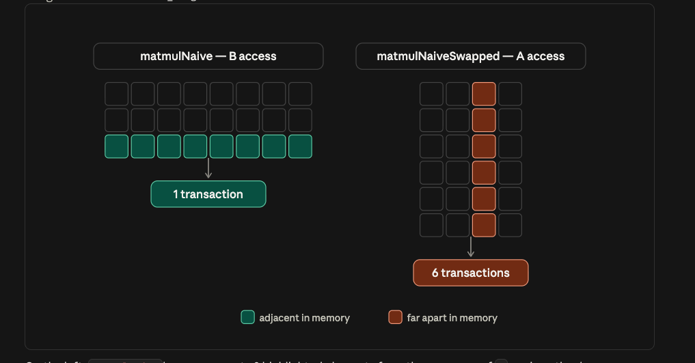

# Phase 1 results — <date>

## Environment

```text
Date:
Host:                    (RunPod pod type / region, or wherever this ran)
GPU:                     (nvidia-smi --query-gpu=name --format=csv)
Driver:
CUDA (nvcc --version):
Compute capability:
SMs:
Peak DRAM bandwidth:     (printed by every exercise)
```

Record the GPU every time. Numbers from a 4090 and an A100 are not comparable —
different memory technology, different bandwidth, different fp32/fp16 ratios —
so a results file without the device on it is worth nothing later.

---

## 1. Vector add

**Predictions**

| question | my guess |
|---|---|
| fastest block size | smallest block |
| best % of peak bandwidth | 100% |
| scattered slowdown factor | ? |
| transfer vs kernel time | transfer time |

**Output**

```text
(base) ri@sysarch-gpu2:/data02/ri/inference-learning/phase1$ ./bin/vector_add
=== Device 0: NVIDIA RTX 6000 Ada Generation ===
  compute capability : 8.9
  SMs                : 142
  warp size          : 32
  max threads/block  : 1024
  max threads/SM     : 1536
  shared mem/block   : 48 KB
  shared mem/SM      : 100 KB
  regs/block         : 65536
  global memory      : 50.87 GB
  memory bus width   : 384 bits
  peak DRAM bandwidth: 960.1 GB/s

N = 16777216 elements (67.1 MB per array)

CPU  :   36.967 ms   (5.4 GB/s effective)
H2D  :    6.533 ms   (20.5 GB/s, 2 arrays)
D2H  :    3.748 ms   (17.9 GB/s, 1 array)

--- one thread per element ---
  block size    kernel ms         GB/s   % of peak   correct
          32       0.3232        622.9         65%       yes
             occupancy: 24 blocks/SM, 24/48 warps = 50%
          64       0.2465        816.9         85%       yes
             occupancy: 24 blocks/SM, 48/48 warps = 100%
         128       0.2464        817.0         85%       yes
             occupancy: 12 blocks/SM, 48/48 warps = 100%
         256       0.2482        811.2         84%       yes
             occupancy:  6 blocks/SM, 48/48 warps = 100%
         512       0.2482        811.2         84%       yes
             occupancy:  3 blocks/SM, 48/48 warps = 100%
        1024       0.2465        816.7         85%       yes
             occupancy:  1 blocks/SM, 32/48 warps = 67%

--- grid-stride, grid sized to the GPU ---
  block size    kernel ms         GB/s   % of peak   correct
          32       0.2471        814.9         85%       yes
          64       0.2471        814.8         85%       yes
         128       0.2445        823.4         86%       yes
         256       0.2420        832.1         87%       yes
         512       0.2391        841.9         88%       yes
        1024       0.2374        847.9         88%       yes

--- uncoalesced, same arithmetic ---
  block size    kernel ms         GB/s   % of peak   correct
          32       1.9784        101.8         11%       yes
          64       1.4657        137.4         14%       yes
         128       1.3493        149.2         16%       yes
         256       0.8109        248.3         26%       yes
         512       0.8762        229.8         24%       yes
        1024       0.7817        257.5         27%       yes

Coalesced vs uncoalesced: 0.2374 ms vs 0.8109 ms  ->  3.4x
One round trip: 10.281 ms of transfer for 0.2374 ms of compute (43x).
```

**What surprised me**
- Coalesced memory access (TODO 2) is about 2-3x faster than uncoalesced memory access (TODO 4)
- This is because when the threads in a warp tell the memory controller what data it needs, the memory controller is able to see that TODO 2 requests 32 conescutive addresses. It's able to fetch that in 1 single load from memory
    - Each float is 4 bytes, so the kernel is requesting 4 * 32 = 128 byte contiguous chunk of memory
    - Each sector is 32 bytes. A sector is the smallest unit of memory the system will ever fetch
    - Hence we are fetching 4 consecutive sectors of memory = 128 bytes fetched
- For TODO 4, the memory addresses are far apart, so it needs to fetch 1 sector 32 times.
    - 32 bytes/sector * 32 = 1024 bytes fetched total
- TODO 2 fetches 128 bytes, TODO 4 fetches 1024, 8x difference


**Explanation**

---

## 2. Transpose

**Predictions**

| kernel | predicted GB/s |
|---|---|
| copy (ceiling) | |
| naive | |
| tiled | |
| tiled + padded | |

**Output**

```text
(paste)
```

**Explanation**

Why padding by one float changed the number it did:

---

## 3. Reduction

**Predicted ranking**

1.
2.
3.
4.
5.

**Output**

```text
=== Device 0: NVIDIA RTX 6000 Ada Generation ===
  compute capability : 8.9
  SMs                : 142
  warp size          : 32
  max threads/block  : 1024
  max threads/SM     : 1536
  shared mem/block   : 48 KB
  shared mem/SM      : 100 KB
  regs/block         : 65536
  global memory      : 50.87 GB
  memory bus width   : 384 bits
  peak DRAM bandwidth: 960.1 GB/s

N = 16777216 elements (67.1 MB), block size 256

              kernel           ms         GB/s   % of peak              sum   correct
        v1 divergent       0.1965        341.6         36%       16777216.0       yes
    v2 non-divergent       0.1258        533.5         56%       16777216.0       yes
       v3 sequential       0.1213        553.1         58%       16777216.0       yes
         v4 load+add       0.0692        969.5        101%       16777216.0       yes
          v5 shuffle       0.0207       3245.4        338%       16777216.0       yes

v5 vs v1, doing identical arithmetic: 9.5x

The exact answer is 16777216.0. Watch the sum column across versions.
```

**Biggest single jump was** v__ → v__, because:

**On the differing sums**

Takeaway:
- there seems to be many ways to do the same thing. Some things that we can control
- how many threads/blocks/grids to launch
    - do we want more threads doing less things or less threads doing more operations?
- memory access:
    - If a thread needs to acces multiple elements, should we stride it or group it
    - I.e. AAAABBBBCCCCDDDD or ABCDACBDABCDABCD
- memory allocation
    - should we use shared memory, or warp coalescing to read from registers
- warp divergence
    - How to structure threads so that all threads in a warp follow the same control flow
- synchronization cost
    - how many barriers does a kernel need and can they be reduced
- bank conflict
    - Shared memory on GPU is physically organized into 32 banks, each 4 bytes wide
    - each bank can service one memory request per cycle
    - If 32 threads hit 32 different banks, all 32 requests can be serviced in 1 cycle
    - If say 4 threads hit the same bank, it will take 4 cycles to serve all 4 requests
    - bank conflicts generally happen when index-to-thread mapping has a stride that is a multiple of 32


---

## 4. Matmul

**Output — CUDA**

```text
(paste)
```

**Output — PyTorch**

```text
nvcc -O3 -std=c++17 -arch=native -lineinfo 04_matmul/matmul.cu -o bin/matmul -lcublas 
GPU 0 utilization: 0%
Below 50% threshold — running ./bin/matmul
=== Device 0: NVIDIA RTX 6000 Ada Generation ===
  compute capability : 8.9
  SMs                : 142
  warp size          : 32
  max threads/block  : 1024
  max threads/SM     : 1536
  shared mem/block   : 48 KB
  shared mem/SM      : 100 KB
  regs/block         : 65536
  global memory      : 50.87 GB
  memory bus width   : 384 bits
  peak DRAM bandwidth: 960.1 GB/s

GEMM: (2048 x 2048) x (2048 x 2048)
Work: 17.18 GFLOP
Ideal arithmetic intensity: 341.3 FLOP/byte
<!--  -->
                kernel           ms      GFLOP/s      vs cuBLAS    correct
naive (row=blockIdx.y)        3.933       4367.6         10.01x        yes
naive (row=blockIdx.x)       32.502        528.6         82.72x        yes
   tiled shared memory        3.063       5609.0          7.80x        yes
                cuBLAS        0.393      43724.8          1.00x        ref
```


**Does torch fp32 match cuBLAS?** If not, why not?

**Arithmetic intensity of a single decode step** (`[1, 4096] @ [4096, 4096]`):

Takeaway:
- swapping the x and y indices results in slower access
- thread indexing increments x for a fixed y
- In matmulNiave, we are fixing a row in A and iterating over columns in B
    - The threads in a warp all have the same row and are accessing 32 consecutive columns in B
    - When the request for the consec columns go to the memory controller at once, the memory controller realizes it can fetch multiple columns worth of data in 1 read, since the requested columns are row-major
    - The total number of reads in 1. If the read size is 32, then 1 read will cover all the columns in the desired current row
- In matmulSwapped, we are fixing a column in B and iterating over rows in A
    - the threads in a warp are requesting consecutive rows in A
    - Each cycle will perform 32 reads (one for each row)


- For the tiled GEMM via shared memory, the idea is we break up our A, B, C into 32x32 patches
- For a given patch in C, we need to take one 32xK row strip from A and Kx32 col strip from B
- We don't do the entire K operations at once. We break it up into (32x32) * K/32 patches and do the matmul within those patches insteas
- The savings come from the fact that each element from A and B is loaded exactly once (into As, Bs respectively)

---

## 5. Streams and launch overhead

```text
(paste)
```

| measurement | value |
|---|---|
| empty kernel launch | µs |
| launch + synchronize | µs |
| chunk count where overhead dominates | |
| best stream speedup | x |

---

## Milestone

> Explain why two kernels doing the same arithmetic can have very different
> performance.

Answer it in your own words, citing your own numbers:

**Open questions to carry into Phase 2**

1.
2.
3.
