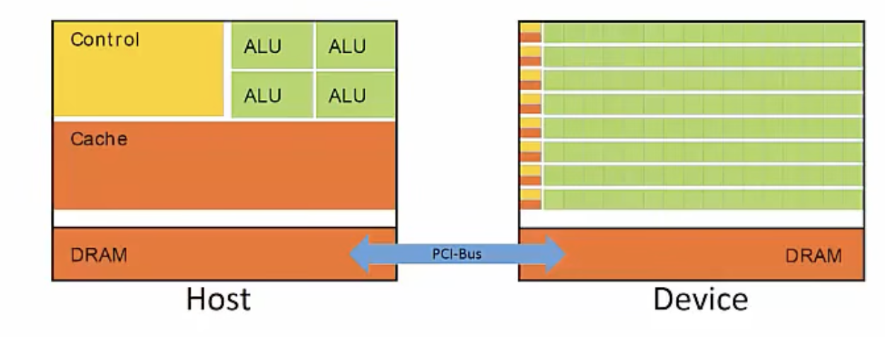
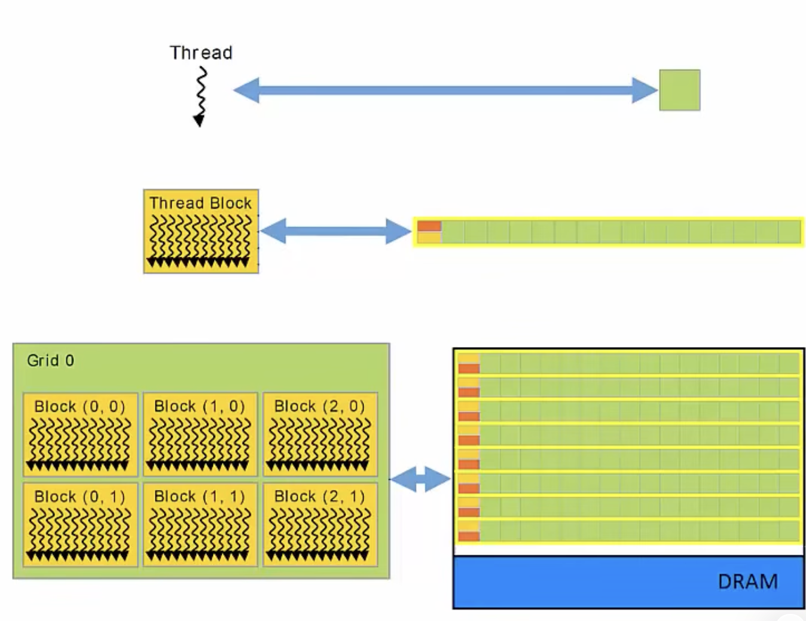
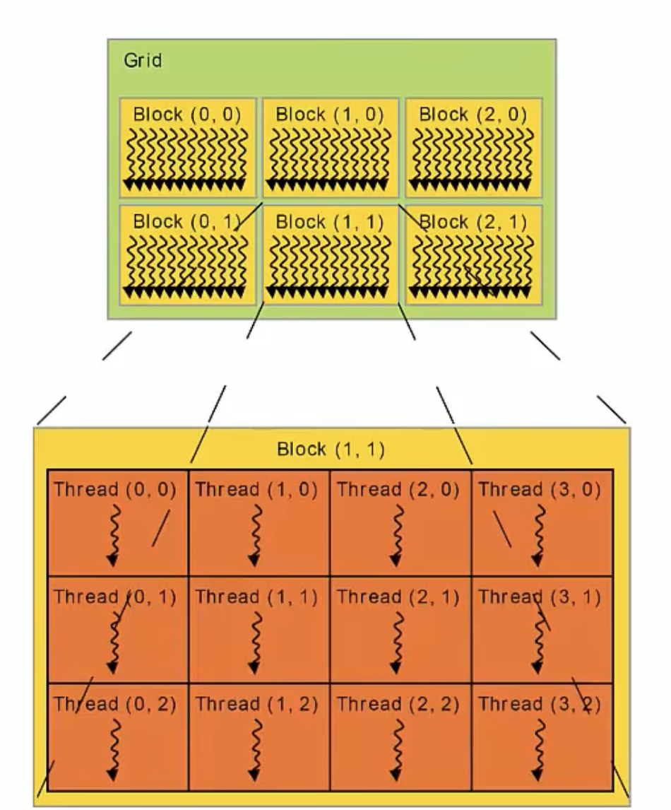

# High Level Concepts

## CPU vs GPU

- CPU is designed to minimize latency
  - majority of silicon area is dedicated to:
    - Advanced Control Logic
    - Large Cache

- GPU is designed to maximize throughput
  - majority of silicon area is dedicated to
    - large number of cores

## How to use CUDA cores
**Kernels**
- Functions that run on the GPU

**Threads**
- Kernels execute as a set of parallel threads

**Host**
- CPU + its on chip memory
   
**Device**
- GPU + GPU memory

**Heterogeneous**
- Host + Device
- Takes advantage for the best of each

CUDA the heterogeneous parallel programming language designed for Nvidia GPUs
- C with a set of extensions that allows for the host and device to work together
- Host is in control of the CUDA program
  - when there is a portion of code that can benefit from massive parallelism, the execution of that portion of code is passed to the device

**CUDA Thread**
- CUDA kernels execute as a large set (1000s) of threads
- CUDA threads execute in a SIMD fashion
- Each thread perfroms the same operation on a subset of data
- Threds execute independently
- Threads don't execute at the same rate
  - I.e. different paths taken in if/else statemetns, different number of iterations in a loop¢

## Organization of Threads
**Thread**
- Kernels execute as a set of Threads

**Blocks**
- Threads are grouped into Blocks

**Grid**
- Blocks are groupd into Grids
- Each Kernel launch creates a single Grid

## Dimensions of Grids and Blocks

Each Grid is composed of a set of Blocks
- Organized into 1D, 2D, or 3D structure
- In this example, its a 2D 3x2 organization of blocks onto the grid

Each Block is composed of a set of Threads
- Organized into 1D, 2D, 3D structure
- In this example, its a 2D 4x3 organization of threads onto each block

In total, we have 4x3 x 3x2 = 72 Threads in a Grid
- When the kernel is launched, 72 threads will be executed on the GPU concurrently

