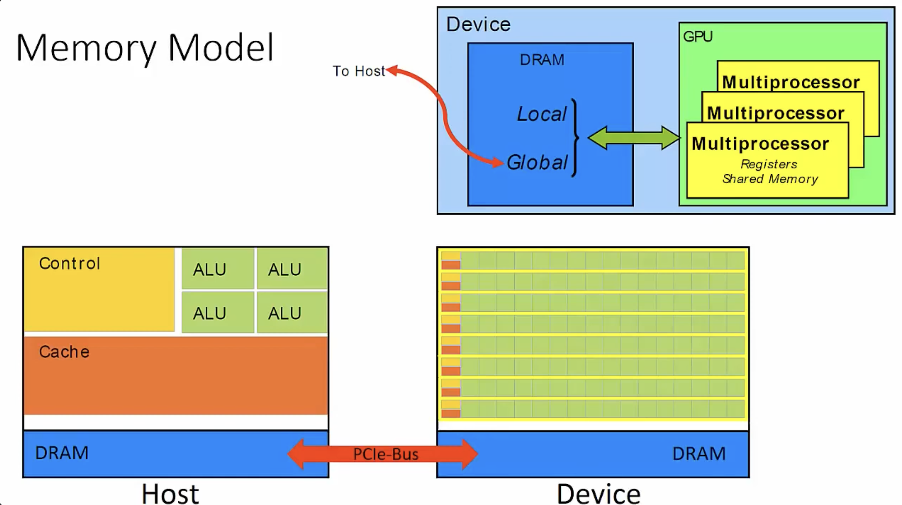
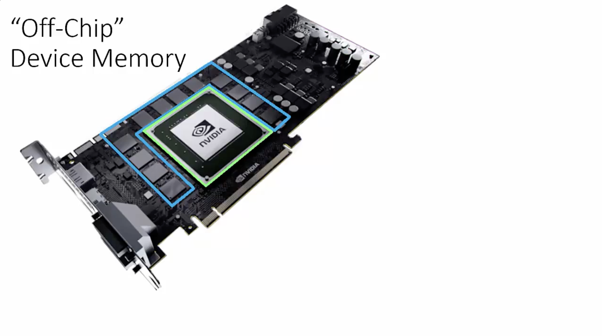
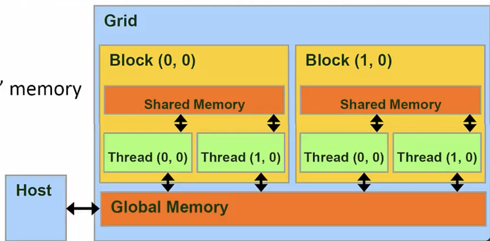
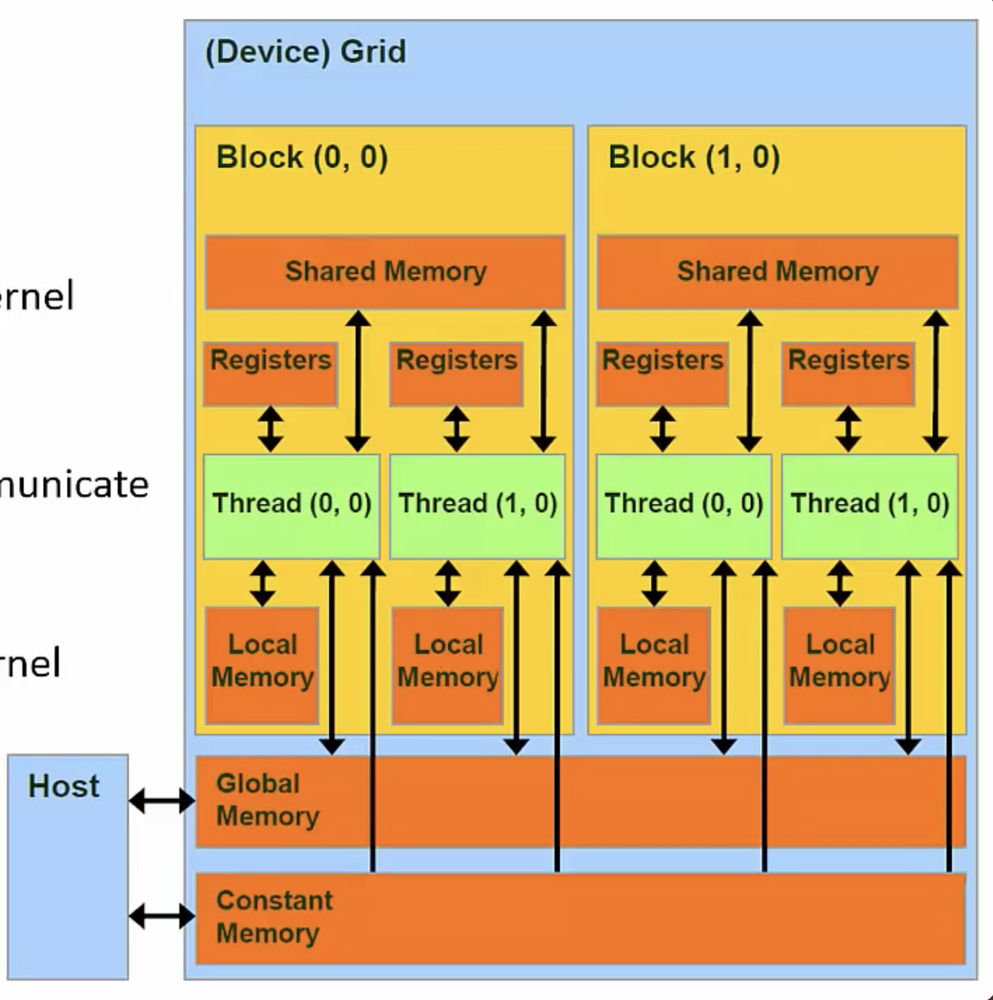

# Memory Model

## Thread-Memory Correspondence

- Threads <=> Local Memory (and Registers)
    - Scope: Private to its corresponding Thread
    - Lifetime: Thread

- Blocks <=> Shared Memory
    - Scope: Every Thread in the Block has access
    - Lifetime: Block

- Grids <=> Global Memory
    - Scope: Every Thread in all Grids have access
    - Lifetime: Entire program in Host code - `main()`

## Memory Model
- The device has memory, which is separated into local and global memory
    - Local and global refer to the scope of the memory, not the physical location

**Streaming Multiprocessor (SM)**
- an SM (yellow) is a collection of CUDA cores (green)
- Memory (local and global) located on SM is called "On-Chip" memory
- Memory not on SM is "Off-Chip"




- Green region is the GPU cores
- Blue region is the off-chip memory


## Memory Speed
- Due to physical design, each memory space has different bandwidth and latencies

```
Registers < Shared << Local = Global << Host (PCIe)
8TB/s       1.5TB/s      200GB/s           5GB/s
1 clock    32 clocks    800 clocks
```

## Global Memory
- When we allocate memory using `cudaMalloc()`, we are allocating memory in Global memory
- Global Memory lives in off-chip DRAM (slower than on-chip memory)


## Registers and Local Memory
- Variables that are declared in a Kernel are stored in Registers
    - On-chip
    - Fastest form of memory

- Arrays that are too large to fit into Registers spill over into Local Memory
    - Off-chip
    - Compiler controlled


## Shared Memory
- Allow Threads within a Block to communicate with each other
- Very fast
- Can be thought of as "user defined L1 cache"

## Using Shared Memory

```
__global__ void kernel(int *in, int N) {
    int i = threadIdx.x + blockDim.x * blockIdx.x;

    // Allocate a shared array
    __shared__ int shared_array[N];

    // each thread wrties to one element of shared_array
    shared_array[i] = in[i]
}
```

- this kernel can be executed by 1000s of threads
- the first thread will show the `__shared__` keyword, and the compiler will store this variable in shared memory
- subsequent threads will overlook the shared allocation


## Constant Memory
- Special Region of Device Memory
    - Used for data with unchanging contents throughout kernel execution
    - Read-Only from Kernel
- Off Chip
- Constant memory is aggressive cached into On-Chip memory


